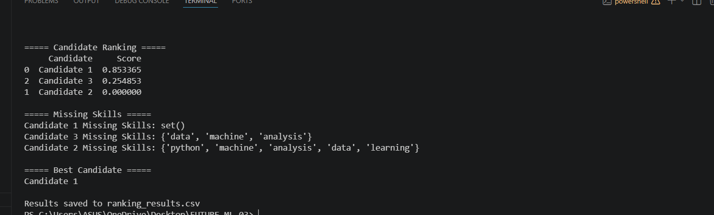

# 🧠 Resume Screening System (Task 3)

## 📌 Project Overview

This project is a **Resume Screening System** that automatically evaluates and ranks candidates based on how well their resumes match a given job description.
It uses **TF-IDF vectorization** and **cosine similarity** to measure relevance between resumes and job requirements.

---

## 🚀 Features

* 📊 Ranks multiple candidates based on job relevance
* 🧠 Uses Machine Learning (TF-IDF + Cosine Similarity)
* 🔍 Identifies **missing skills** for each candidate
* 🏆 Selects the **best candidate automatically**
* 💾 Saves results in a CSV file (`ranking_results.csv`)

---

## 🛠️ Technologies Used

* Python
* Pandas
* Scikit-learn
* TF-IDF Vectorizer
* Cosine Similarity

---

## 📂 Project Structure

```
FUTURE_ML_03/
│── resume_screening.py
│── ranking_results.csv
│── README.md
```

---

## ▶️ How It Works

1. Input resumes and job description
2. Preprocess text (cleaning & formatting)
3. Convert text into numerical vectors using TF-IDF
4. Calculate similarity between resumes and job description
5. Rank candidates based on scores
6. Identify missing skills
7. Output best candidate and save results

---

## ▶️ How to Run

```bash
python resume_screening.py
```

---

## 📈 Sample Output

* Candidate ranking with scores
* Missing skills for each candidate
* Best candidate selection
* CSV file with results

---

## 🎯 Learning Outcomes

* Text preprocessing in NLP
* Feature extraction using TF-IDF
* Similarity measurement using cosine similarity
* Basic implementation of resume screening systems

---

## 📌 Conclusion

This project simulates a real-world hiring process by automating resume evaluation.
It helps recruiters quickly identify the most suitable candidates and analyze skill gaps efficiently.

---
## 📸 Output Screenshot



## 🔗 Author

**Gangala chetan vamsi**

---

## 🚀 Conclusion

This project demonstrates how machine learning techniques can automate resume screening and help select the best candidate efficiently.
